# El juego

Gao, el escultor de la obra de Tezuka, recorre seis fases de abajo arriba
hasta llegar a los torii, las puertas que llevan a la
sala de cada fase. El mapa sube solo mientras avanzas y los lados no acaban
nunca.

Todas las imágenes de esta página están **dibujadas desde los bytes de la
ROM** con las herramientas de `tools/`, que siguen los pasos del propio
cartucho. Debajo de cada una se dice de qué tabla sale y cómo se ha cotejado
contra openMSX (MSX2, `C-BIOS_MSX2_JP`).

## El logotipo y el título

El logotipo son 52 letras de 1 bit del banco 9 (`p09:AB3C`, `ABA4` y
`AC0C`) que `p00:4ED7` sube a la página 1 en tres colores, y que
`p01:6710` compone con la lista de `p01:675E`; luego `p01:66F0` lo destapa
de arriba abajo con HMMM. Cotejado contra openMSX: **0 bytes distintos**.

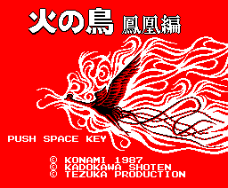

El título es una hoja de dibujos (las listas de `p04:6443`, `6458` y
`6468`) pintada con los mapas de `p13:7640` y `p13:79A0` (32 × 18) y el
rótulo 火の鳥 鳳凰編 (`p13:7D00` y `7D30`) encima con el color 0
transparente; los textos, con la letra de la hoja (`p00:4F87`). Cotejado:
**0 bytes distintos** y los 16 colores de `p00:5BE9`.

## Las seis fases y sus puertas

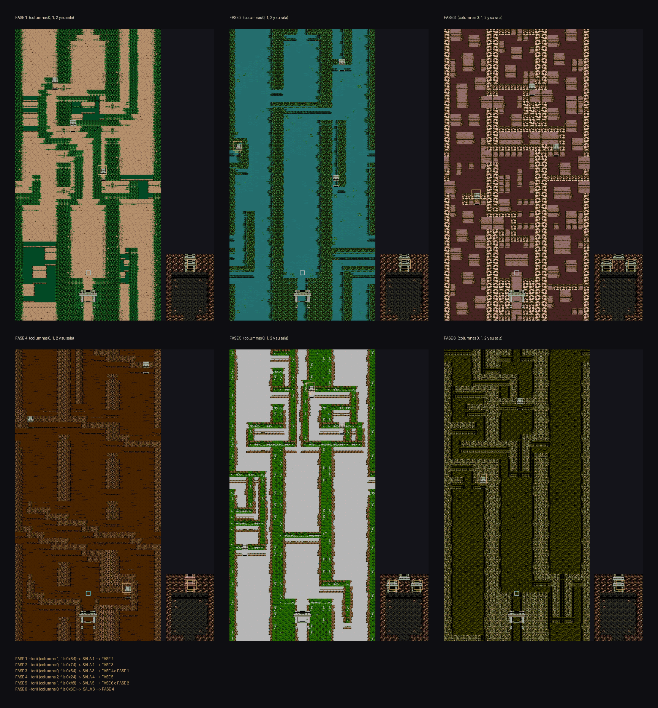

Cada fase son **tres columnas** de 256 × 1.536 puntos, una al lado de otra,
y una **sala** aparte. Por los lados, las columnas dan la vuelta
(`p01:653A`: de la 2 se pasa a la 0 y al revés); por arriba, el mapa vuelve
a empezar. Las 24 áreas (`0xC480`) son 3 × 6 columnas y 6 salas, y la tabla
`p01:660B` da la fase, el juego de dibujos y la columna de cada una.

Un mapa es una lista de **superfilas** (una por cada 32 puntos de alto,
`p00:597B`); cada superfila son ocho **bloques** de 4 × 4 dibujos
(`p00:594B`, `p00:593B`); y cada dibujo, uno de los 256 de la **hoja** de la
página 1 de la VRAM, que suben las listas del banco 4 con ocho formatos
(4 bits tal cual, 1, 2 o 3 bits con paleta, y los cuatro al revés,
`p00:54CC`).

Las **puertas** son cosas del camino: la de tipo 4 es el torii de cada fase
y la de tipo 5 la salida de la sala. Las dos llevan un número, y
`p01:607C` lee la puerta de `p09:A269`: el área, la fila y el sitio de
llegada. El camino que sale de la tabla:

| de | por | a |
|---|---|---|
| fase 1 | torii de la columna 1, fila 0x64 | sala 1 |
| sala 1 | su torii | fase 2 |
| fase 2 | torii de la columna 0, fila 0x74 | sala 2 |
| sala 2 | su torii | fase 3 |
| fase 3 | torii de la columna 0, fila 0x54 | sala 3 |
| sala 3 | torii de la izquierda / de la derecha | fase 4 / **fase 1** |
| fase 4 | torii de la columna 2, fila 0x24 | sala 4 |
| sala 4 | su torii | fase 5 |
| fase 5 | torii de la columna 1, fila 0xA8 | sala 5 |
| sala 5 | torii de la izquierda / de la derecha | fase 6 / **fase 2** |
| fase 6 | torii de la columna 0, fila 0x6C | sala 6 |
| sala 6 | su torii | fase 4 |

Se entra siempre por la columna 1, en la fila 0x1F. Sale de las tablas; no
lo hemos recorrido jugando. Una lámina por fase, a tamaño real:

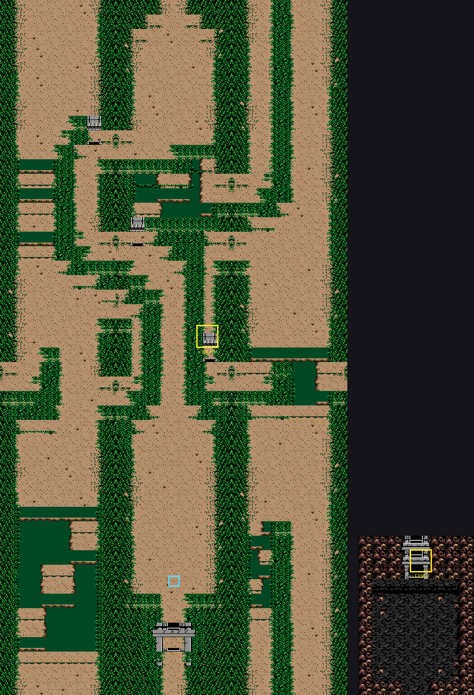
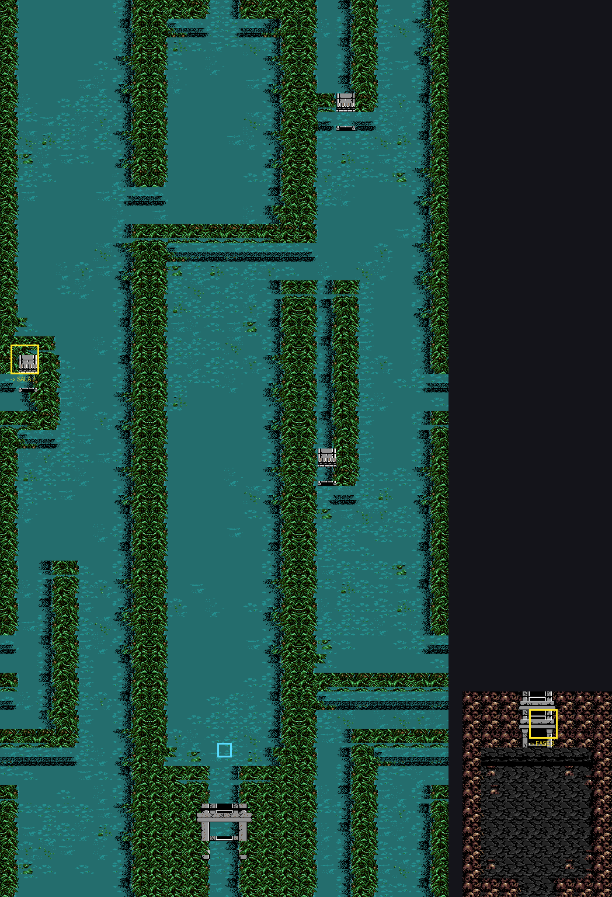
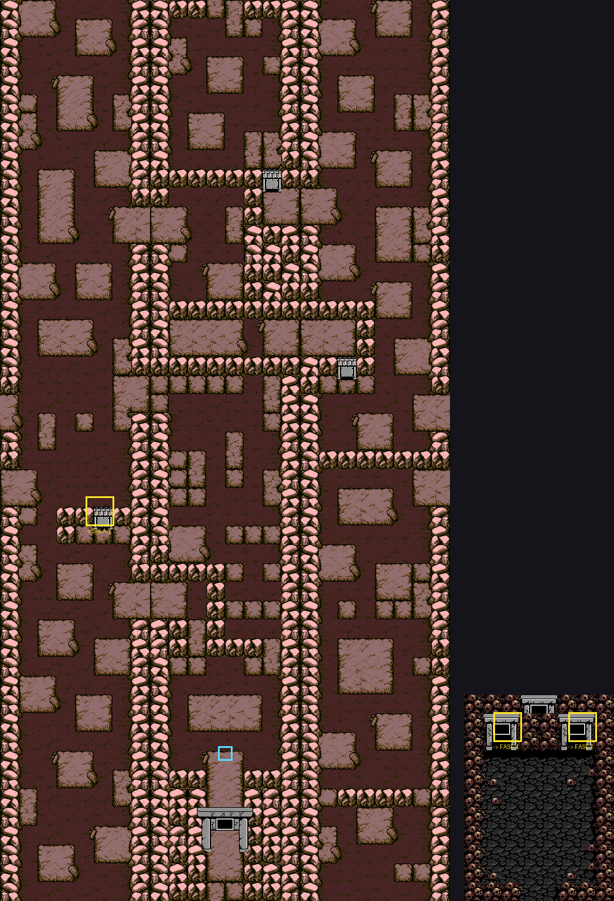
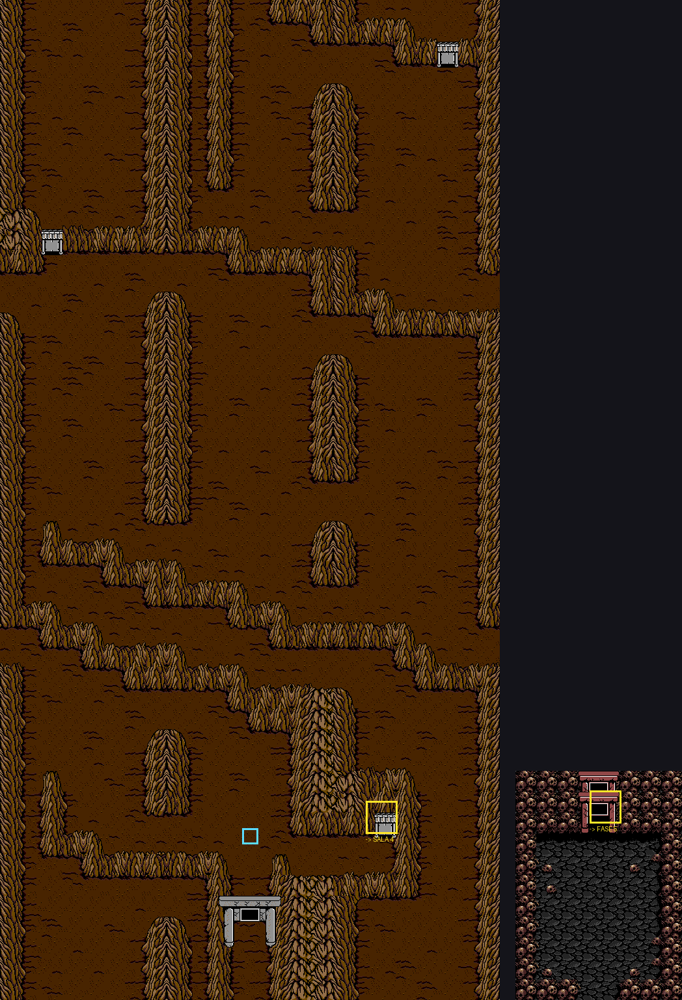
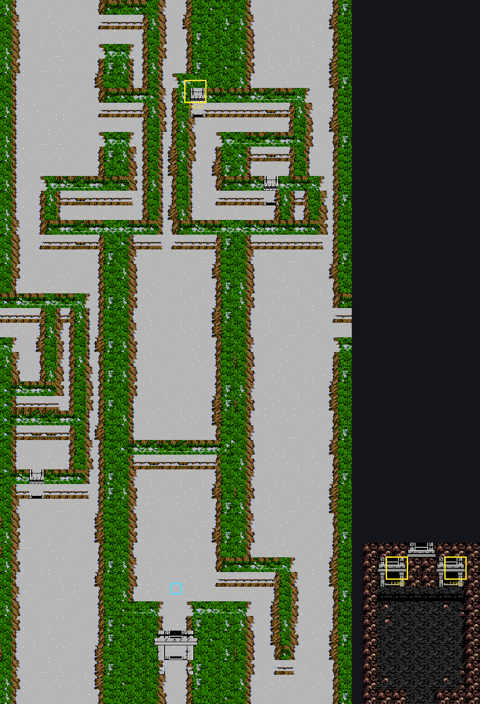
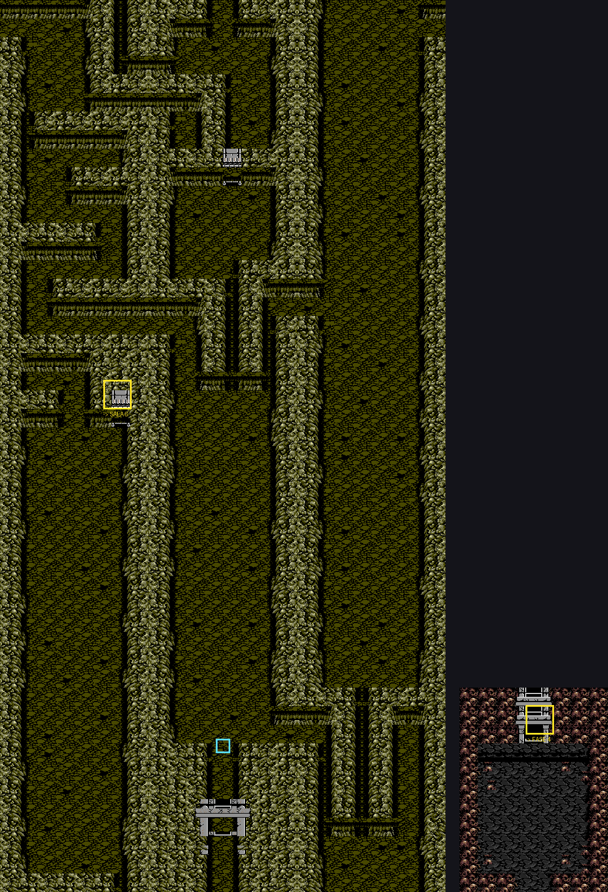

Cotejo: la hoja de dibujos y la paleta de las áreas 0 y 1, volcadas en
openMSX al acabar de montarlas (`p00:5D6E`), son **idénticas**: 189 y 225
dibujos, 0 distintos, y los 16 colores. En pantalla, las filas del mapa
están en la tabla de dibujos de la RAM (31 de 32; la otra la pisa lo que se
mueve).

## Gao

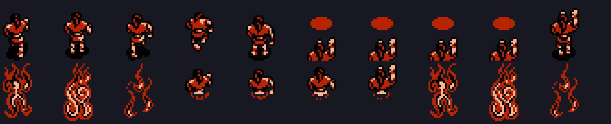

Cada pose son dos sprites de 16 × 16 (arriba y abajo), y cada uno, dos
patrones que se ponen uno encima de otro con la mezcla OR del V9938: los
colores 13 y 14 y, donde se juntan, el 15. `p02:93D6` sube los dos de la
pose `0xC81C` desde `p06:A0BB`.

## Lo que sale en cada área

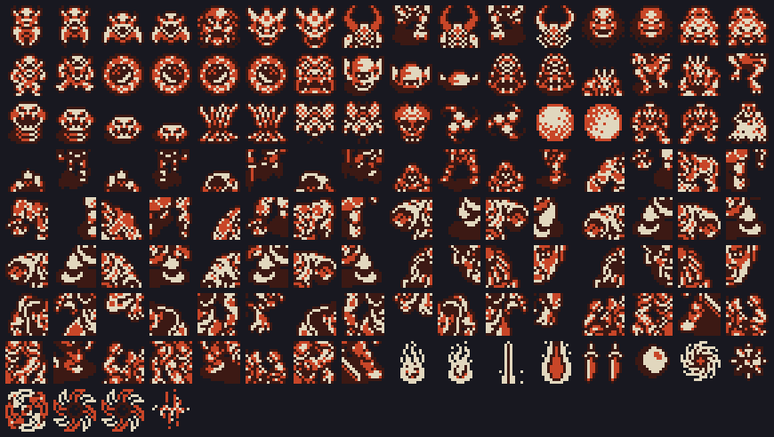

Cada área carga en los patrones de sprite las **cosas** que va a usar
(`p07:6000` + 2 × área, pares [cosa][sitio]); las 41 cosas de `p07:6173`
son RLE o bytes tal cual. Aquí están los 132 sprites de dos capas: los
enemigos, los jefes a trozos y lo que lanzan. El color lo pone cada bicho al
moverse, así que van en dos tonos.

Qué bicho sale y cuándo lo dice el banco 9: `p09:A162` da la lista de cada
área ([fila][tipo][dato], `p01:6CFC`) y `p09:A186`, qué tipos salen en cada
tramo de 32 filas. Hay 58 tipos de bicho, cada uno con su rutina de nacer
(`p01:6E80`) y de moverse (`p01:6875`).

## Los objetos

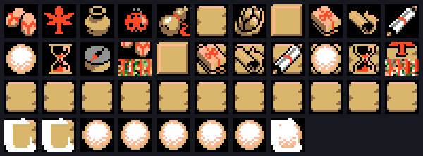

Son 41, con su cuenta en `0xC850` + 4 × (objeto − 1). La ventana ITEM
INFORMATION (F3, `p06:BAC2`) los pinta con `p01:7B60`: iconos de 16 × 16 de
la hoja; del 16 en adelante, un icono encima de un fondo. F5 enseña el mapa
de las fases y, con el objeto 14, deja saltar a otra (`p02:8555`).

## El menú secreto

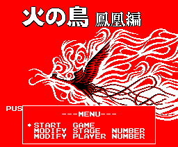

Con Q*bert o el Game Master en otra ranura, ESPACIO en el título abre este
menú (`p00:4705`): START GAME, MODIFY STAGE NUMBER y MODIFY PLAYER NUMBER.
Visto en openMSX con Q*bert y montado desde la ROM: 0 bytes distintos.

## El sonido

`p14:9C47` tiene 120 entradas, una por sonido y canal; las piezas de varios
canales ocupan varias seguidas. Las pistas están en los bancos 14 y 15, con
notas, órdenes de octava, tempo, volumen, vibrato y repeticiones
(`p14:94FA`).
