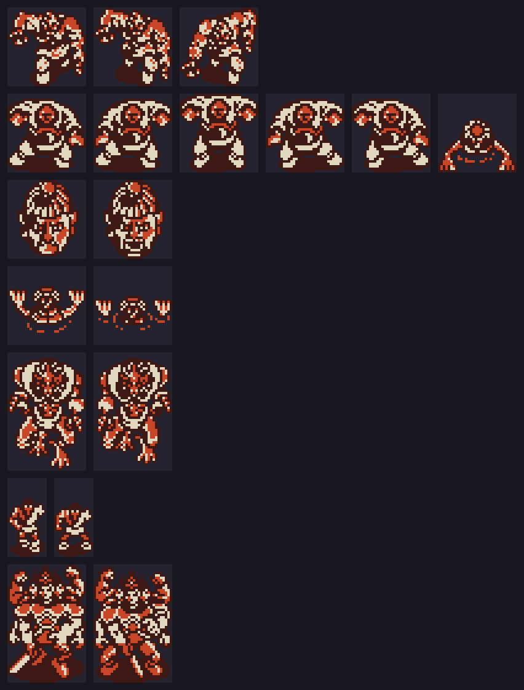

# Hallazgos

Lo que el código esconde. Cada cosa lleva la dirección donde está y cómo se
sabe: **medido en openMSX** (con los volcados de RAM o VRAM) o **sale del
código** (leído, sin jugarlo).

## Con King Kong 2 al lado, arranca King Kong 2 y le graba la partida

Al encender, `p00:5DFF` lee con `RDSLT` las otras ranuras buscando tres
firmas (`p00:5E78`): seis bytes en `0x7FFA` (el Game Master, RC-735), la
cabecera `'CD' 07 45 FF` en `0x4010` (King Kong 2, RC-745) y seis bytes en
`0xBFFA` (Q*bert, RC-746). Con **King Kong 2**, `0xC110` = 2 y INIT se va a
`p09:B880`:

1. lee de la otra ranura el INIT de King Kong 2 (su palabra `0x4002`) y copia
   256 bytes de allí a `0xF120`;
2. copia 170 bytes suyos (`p09:B925`) a `0xF220` y pone `jp 0xF220` en el
   gancho de la interrupción;
3. salta a `0xF120`: arranca King Kong 2.

Cada cuadro, el gancho mira si King Kong 2 está jugando (su `0xC100` = 5) y
las teclas: con **F4**, pone Hinotori en las páginas 1 y 2 (`ENASLT`) y
llama a su código de **grabar** (`p09:B9CF`); con **F5**, al de **cargar**
(`p09:BA9C`). Las dos usan las rutinas de cinta de la BIOS (`TAPOON`,
`TAPOUT`, `TAPION`, `TAPIN`) y piden un nombre de fichero.

**Medido en openMSX** con Hinotori en la ranura A y King Kong 2 en la B:
arranca King Kong 2 (el PC corre en `0xF1xx`, `0xFD9F` = `jp 0xF220`), y al
pulsar F4 jugando `0xF106` = 1, `0xF107` = 1 y en su pantalla sale
«SAVE MODE / INPUT FILE NAME».

## Con Q*bert o el Game Master, un menú y la tecla STOP

Con cualquiera de los otros dos, `0xC110` = 1. Al pulsar ESPACIO en el
título, `p00:46B1` va al estado 9 en vez de empezar: un menú con START GAME,
MODIFY STAGE NUMBER y MODIFY PLAYER NUMBER, donde se teclea la fase
(`0xC115`) y las vidas (`0xC117`) con las teclas de números. **Medido en
openMSX** con Q*bert en la ranura B: el menú, montado aquí desde la ROM, da
0 bytes distintos.

Y la interrupción, con `0xC110` distinto de 0, mira la tecla **STOP**
(`p00:4124`): el juego se congela y el PSG se calla hasta la siguiente
pulsación. **Sale del código.**

## Las contraseñas de truco

Con **F1** se pausa; con **HOME** sale la contraseña de la partida y con
**HOME** otra vez se escribe una. `p06:B85E` la compara con las 17 cadenas de
`p06:B8A0`; cada cadena va seguida del código que hace, al que salta con
`jp (hl)` (`p06:B89A`), y cada una vale **una vez por partida**
(`0xC600` + n). Se acepta con «CORRECT». Las otras contraseñas son las de
verdad: llevan el estado de la partida y una comprobación (`p06:B7EE`: el
XOR de todos los caracteres tiene que dar 0).

| contraseña | lo que hace el código | medido |
|---|---|---|
| GAOOOOOOOOOOH | vidas + 10 (`0xC160`, en BCD) | 2 → 12 |
| ILOVEHINOTORI | `0xC4E2` = 1: cada cuadro, invulnerable (`p02:8600`) | sí |
| NANDANANDANANDA | `0xC4E0` = 1: al perder una vida se devuelve (`p00:441A`) | sí |
| METALSLAVE | la vida (`0xC845`) a 200, el máximo | del código |
| HANEYOKAGAYAKE | `0xC4E3` = 1: lo que da 1 de vida da 10 (`p03:AC8F`) | sí |
| FULLITEMDAYOON | 1 en todos los bytes de los objetos 1-15 | sí |
| KINOOOIHITODANE | 1 en todos los bytes de los objetos 16-33 | sí |
| SUPERBALL | 1 en los objetos 36-40 | sí |
| TURBO | el objeto 1 a 3 | sí |
| HAYAME | el arma (`0xC85C`, el objeto 4) a 3 | sí |
| AUTOSHOT | el arma a 3 y `0xC4E1` = 1: cada cuadro, el arma 4 (`p02:8F56`) | sí |
| ULTRABOX | el objeto 9 a 9 | sí |
| KOKOWADOKO | el objeto 10 a 6 | sí |
| DOKODEMOMAP | el objeto 11 a 6 | sí |
| HOIHOIHOINOHOI | el objeto 14, el de saltar de fase, a 9 | sí |
| ENDDEMOGAMITAINA | `0xC4DA` = 0x000C: al volver, el estado 12, el final | sí |
| aaaaa | objetos a 3 e invulnerable (`0xC4D1`) | **no se puede escribir** |

«aaaaa» está en minúsculas, y `p06:B5AB` pasa a mayúsculas todo lo que se
teclea antes de guardarlo: nunca puede coincidir. «Medido» es que se ha
tecleado en openMSX (`tools/omsx_guion.tcl`) y se ha visto el cambio en la
RAM.

## Las fases dan la vuelta, y solo se sale por un torii

Las columnas de una fase se unen por los lados: saliendo por la derecha de
la 2 se entra en la 0, y por la izquierda de la 0 en la 2 (`p01:6522`,
`p01:653A`). Por arriba, el mapa de cada columna acaba en `0xFF 0x0000`:
vuelve a la fila 0 (`p00:580E`). Se sale solo por el torii de la fase.
**Sale de las tablas y del código.**

## 18 puertas, y un camino que no es recto

La tabla de `p09:A269` tiene 18 puertas de seis bytes. Las 0-5 son los torii
de las fases y llevan a su sala; las 6-13, las de las salas, llevan a la fase
siguiente, salvo que la sala 3 tiene otra que vuelve a la **fase 1**, la sala
5 otra que vuelve a la **fase 2**, y la de la sala 6 lleva a la **fase 4**.
Las 14-17 llevan al área `0x18`, que no existe: ninguna lista de cosas las
usa. El recorrido entero está en [El juego](EL-JUEGO.md). **Sale de las
tablas.**

## El salto de fase

F5 abre un mapa de las seis fases (`p02:8555`). Si se lleva el objeto 14
(`0xC884`), los cursores eligen una (`0xC887`) y ESPACIO salta allí, gastando
uno (`p02:859F`); se llega por la columna 1 (`p01:65CF`). **Sale del
código.**

## Siete figuras que no usa nadie

De `p07:7457` a `p08:82B3` hay 18 tiras seguidas en el RLE de los sprites
(`p00:4A8D`), 3.676 bytes; abiertas dan de 128 a 320 bytes cada una, tamaños
de juegos de patrones. Ese RLE solo lo abre `p00:4AD5`, que recorre las
listas de cada área, y ninguna entrada nombra ninguna; la sonda de lecturas
de openMSX tampoco las lee.

Abiertas y leídas como los sprites que sí se usan (dos patrones seguidos son
las dos capas de un sprite de 16 × 16, y los sprites de una figura van por
columnas), son seis figuras que no salen en el juego. Justo detrás, de
`p08:82B3` a `0x85B3`, hay 768 bytes que tampoco lee nadie: doce sprites a
dos capas sin comprimir, en dos columnas de tres. Es una séptima figura.
Ninguna de las siete coincide con ninguno de los 41 juegos de sprites que se
cargan:

| tiras | figura |
|---|---|
| 0-2, leídas seguidas | una bestia jorobada, 32 × 32, tres fotogramas |
| 3-7 y 12 | un monstruo de un ojo con brazos enormes, 32 × 32, seis posturas |
| 8-9 | una cara, 32 × 32, dos fotogramas |
| 10-11 | algo que sale del suelo con dos garras, 32 × 32 |
| 13-15, leídas seguidas | un demonio, 32 × 48, dos fotogramas: el dibujo más grande del cartucho |
| 16-17 | un guerrero pequeño con cinta en la cabeza, 16 × 32, dos fotogramas |
| `p08:82B3`, sin comprimir | un guerrero de varios brazos y varias caras, 32 × 48, dos fotogramas |

En dos tonos, como los bichos: el color lo pone el código de cada bicho, y
estas no tienen. Qué eran no se sabe. **Medido en la ROM**
(`tools/figuras.py huerfanas`).

## La cabecera para otros cartuchos

En `0x4010`: `'C'`, `'D'` y una lista de direcciones de la RAM de este juego.
Ningún código de Hinotori la lee. King Kong 2 lleva otra igual en el mismo
sitio, y es lo que Hinotori busca en él para saber que está.

## Los créditos del final, y un truco con nombre de diseñador

El final sube los créditos línea a línea por abajo de la pantalla
(`p06:AF12`, con la lista de punteros de `p06:AB23`). Transcritos de la ROM,
tal cual:

| | |
|---|---|
| PROGRAMMER | ULTRAMAN ADACHI · ADDE EDA · YOSHIMOTO OHTA · DARENANDA SUZUKI · 27INCH NAGAE |
| DESIGNER | SHU IWAMOTO · KI MIZUTANI · HAAAA MAKITANI · METALSLAVE NAOKI |
| SOUND | MOAI SASAKI · SG FURUKAWA |
| SPECIAL THANKS TO | PAKEMI KAMIO · ROOM 1013 · AND YOU |
| | PRESENTED BY KONAMI · © KONAMI 1987 |

METALSLAVE, el apodo de uno de los diseñadores, es también una de las
contraseñas de truco: la que llena la vida. **Medido en la ROM.**
